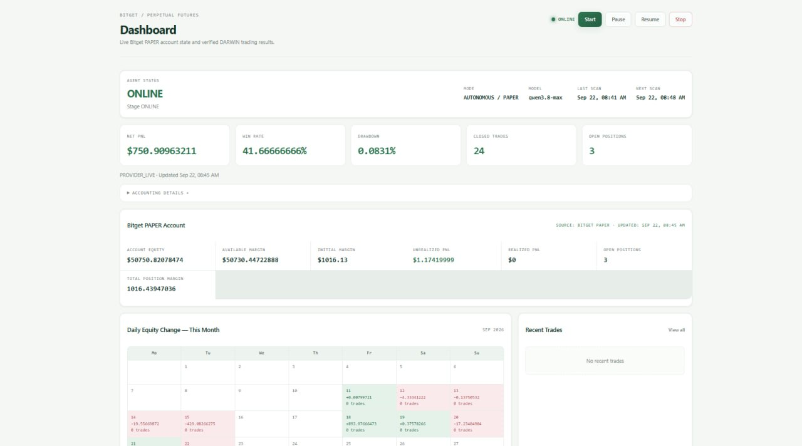
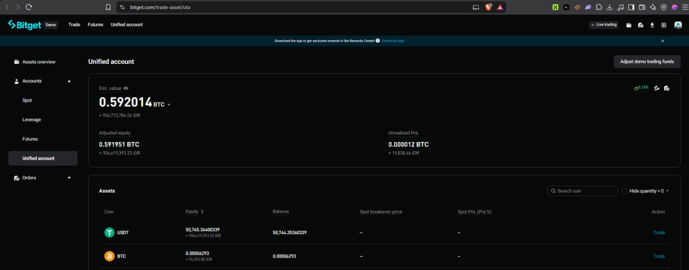
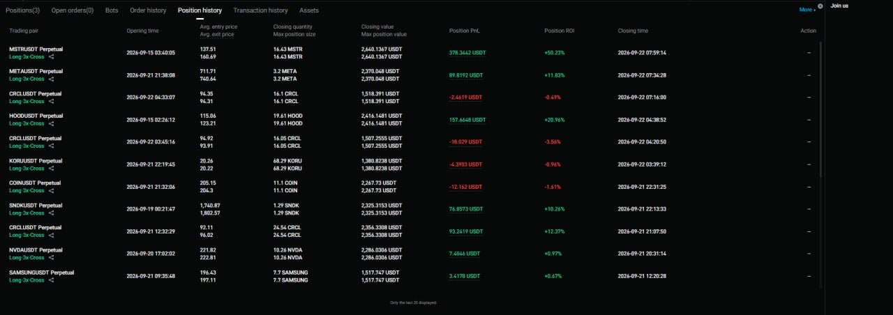
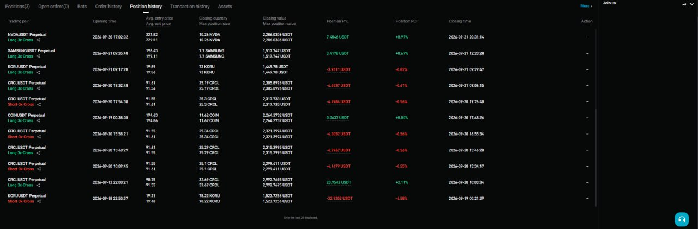

# Provider-Verified PAPER Evidence

Runtime: `AUTONOMOUS / PAPER`  
Commit: `3ad1a64b2a3314be3ca3da6e2571304aa2c23186`  
Evidence captured: `2026-09-22`  
Provider: **Bitget Unified Account**

DARWIN does not treat its internal journal as the financial source of truth.

The linked Bitget Unified Account is the authoritative source for:

- account equity;
- current positions;
- executed orders;
- realized and unrealized PnL;
- fees; and
- position history.

DARWIN reads provider state and adds the decision layer explaining why the
autonomous agent opened, held, reduced, or closed a position.

## 1. Account state matches Bitget Unified Account





At the captured observation, the DARWIN dashboard shows a provider-live
Bitget PAPER account with account equity, available margin, unrealized PnL,
and current open positions. The adjacent Bitget screenshot shows the linked
Unified Account's estimated value, adjusted equity, unrealized PnL, and asset
balances.

This is provider-derived account state. DARWIN does not reconstruct the
account balance from local trade logs.

## 2. Closed-position results are independently visible on Bitget





Bitget Position History independently exposes:

- opening time;
- average entry price;
- average exit price;
- closing quantity;
- position PnL;
- ROI; and
- closing time.

Examples visible in the provider history include both profitable and losing
positions:

- `MSTRUSDT`: `+378.3442 USDT`;
- `METAUSDT`: `+89.8192 USDT`;
- `HOODUSDT`: `+157.6648 USDT`; and
- visible losing `CRCLUSDT` and `KORUUSDT` positions.

The mixture of wins and losses is intentionally shown. The evidence is not
limited to profitable examples.

## 3. Full DARWIN audit trail

The live dashboard includes a downloadable journal export:

```text
GET /api/export/paper-log?format=json
GET /api/export/paper-log?format=csv
```

The journal contains the autonomous audit trail for:

- market evidence;
- candidate selection;
- strategy reasoning;
- risk-gate result;
- `OPEN` / `HOLD` / `REDUCE` / `CLOSE` decisions;
- execution requests;
- provider order identifiers;
- reconciliation evidence; and
- reflections and lessons.

This lets reviewers inspect both sides of the authority boundary:

```text
Bitget:  what financially happened
DARWIN:  what happened, why the autonomous agent decided it,
         and what provider evidence verified it
```

## Recommended reviewer path

```text
README
  ↓
30-second architecture explanation
  ↓
provider evidence screenshots
  ↓
live website
  ↓
download journal
  ↓
inspect exact cycles, orders, and reasoning when deeper proof is needed
```

The screenshots provide fast visual proof. The downloadable journal provides
the deeper cycle-level audit trail.
